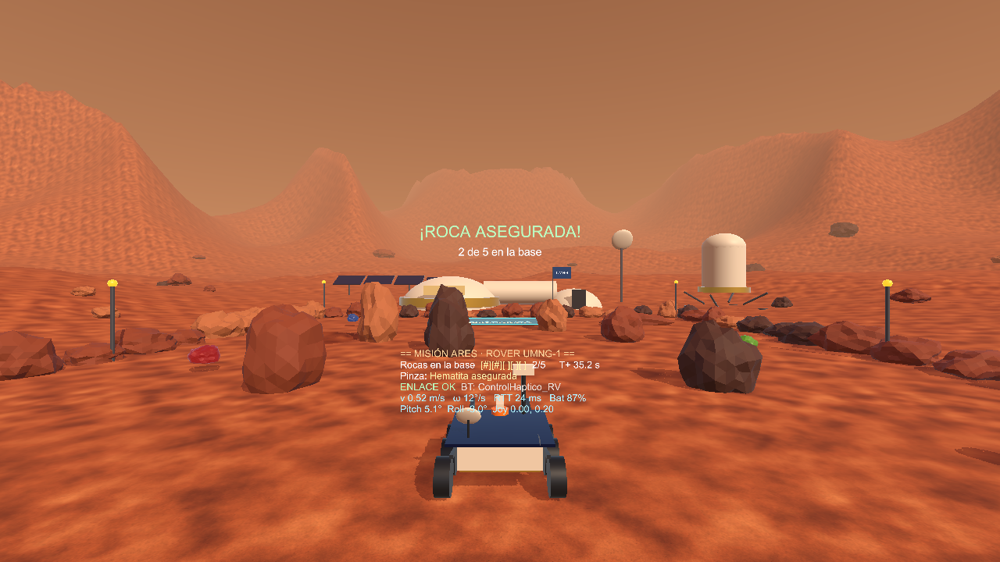
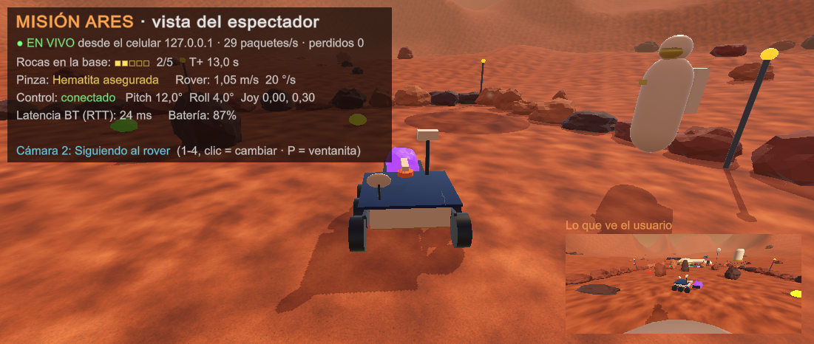

# MISIÓN ARES — Teleoperación de Robot Móvil en Entorno Virtual Inmersivo con Control Háptico Inalámbrico

Proyecto de Realidad Virtual · Ingeniería Mecatrónica · Universidad Militar Nueva Granada (UMNG) · 2026

Un rover en Marte se teleopera desde un **visor tipo Cardboard** (celular con giroscopio), con un **control háptico inalámbrico hecho por el equipo**. El control lleva un ESP32, una IMU MPU6050, un joystick HW-504 y un motor vibrador, y se conecta por Bluetooth. La misión es recoger 5 rocas marcianas con la pinza del rover y llevarlas a la **Base Ares**. Mientras tanto, el computador muestra en vivo lo que pasa (**modo espectador**).

## Contenido del repositorio

| Carpeta / archivo | Qué contiene |
|---|---|
| `TeleoperacionRV.apk` | App para el celular (Android 8+). Instalar y emparejar el control `ControlHaptico_RV`. |
| `Espectador_PC/` + `ABRIR_ESPECTADOR_PC.bat` | Programa de Windows del **modo espectador**. Recibe la simulación del celular por Wi-Fi. |
| `1_Unity_TeleoperacionRV/` | Proyecto Unity 6 (6000.3.8f1). El menú **Teleoperación RV** reconstruye la escena y genera el APK y el programa del PC. |
| `2_Firmware_ESP32/` | Firmware del control háptico (Arduino IDE, placa *ESP32 Dev Module*, core esp32 3.x) y prueba del motor. |
| `3_Carcasa_CAD/` | Carcasa paramétrica en OpenSCAD + STL de base y tapa (impresión 3D). |
| `4_Diagramas/` | Arquitectura, diagrama eléctrico, conexiones, comunicación y mapeo del control. |
| `5_Analisis_Resultados/` | `analizar_metricas.py`: convierte los CSV de métricas de la app en gráficas y estadísticas. |
| `6_Informe/` | Informe técnico y guía paso a paso (Word). |
| `G-RV-TeleoperaciónRobotEntornoVirtual-2026.pdf` | Guía oficial del proyecto. |

## Cómo funciona

- **Rover:** el *pitch* del control mueve el rover adelante y atrás, y el *roll* lo gira. El mapeo es proporcional, con zona muerta de 6°, máximo de 30° y exponente 1.5.
- **Avatar:** el joystick en Y camina y en X gira. Presionar el joystick agarra o suelta la roca.
- **Háptica (PWM):** hay patrones distintos para el choque con una roca, el choque con una pared o límite, el agarre y la roca asegurada en la base.
- **Visor:** estéreo tipo Cardboard con corrección de lente. La cabeza se sigue con el giroscopio y la app gira entre las dos posiciones horizontales.
- **Modo espectador:** el celular envía el estado de la escena por UDP (puerto 47777) y el PC lo muestra con 4 cámaras. Así quedan el computador, el visor y el control como en la figura 3 de la guía.
- **Métricas:** la app guarda CSV con muestras, eventos, latencia (RTT) y paquetes perdidos en `Android/data/com.umng.teleoperacionrv/files/Metricas`.

## Hardware

ESP32 DevKit · MPU6050 (SDA 21, SCL 22) · Joystick HW-504 (VRy 35, VRx 32, SW 25, VCC 3V3) · módulo de motor vibrador (IN 23) · batería de 12 V → interruptor → LM2596S (5 V) → VIN · divisor de 100 k/22 k a GPIO34 para medir la batería.

## Protocolo Bluetooth (SPP, texto)

- ESP32 → Unity: `D,seq,pitch,roll,agarre,adelante,atras,bateria,joyY,joyX` a 50 Hz, además de `P,id`, `I,...` y `K`.
- Unity → ESP32: `H,patron,intensidad` (1 objeto, 2 pared, 3 agarre, 4 éxito), `P,id` y `C`.

## Prueba rápida en el PC (sin control)

Abre el proyecto en Unity y presiona **Play**. Los controles son:

- **W/S:** mover el rover.
- **A/D:** girar el rover.
- **G:** agarrar o soltar.
- **↑/↓:** caminar.
- **←/→:** girar el avatar.
- **Clic derecho + ratón:** mirar alrededor.
- **R:** reiniciar.
- **M:** activar o desactivar el estéreo.
